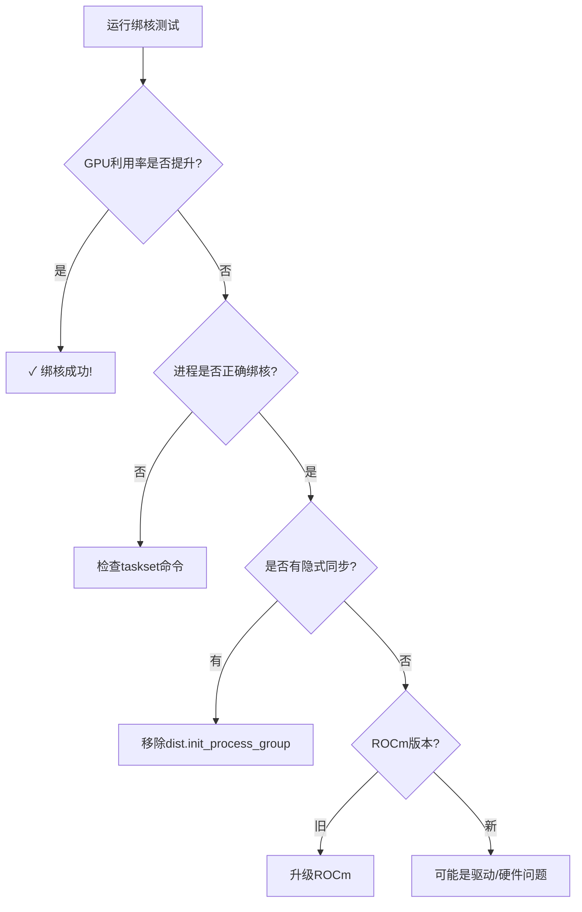

# 修改说明和使用指南

## 修改的文件

### 1. benchmark_attention.py
**主要修改：**
- ✅ 第22行：启用 `torch.set_num_threads(1)` - 避免CPU线程竞争
- ✅ 第35-36行：添加 `torch.cuda.set_device(rank)` 和 `device` 变量 - 正确设置GPU
- ✅ 第38行：添加CPU亲和性打印 - 调试用
- ✅ 第41-43行：修改为使用 `device` 变量创建tensor
- ✅ 第198行：修改 `k_lens` 使用正确的device
- ✅ 删除第37-39行的sleep代码 - 所有进程同时开始

**功能：**
- 支持通过 `-rank` 参数指定GPU
- 自动设置正确的CUDA设备
- 使用单线程避免CPU竞争
- 生成profiler trace用于性能分析

### 2. benchmark_sh2.sh
**完全重写为优化版本：**
- ✅ 设置环境变量（OMP_NUM_THREADS等）
- ✅ 使用 `numactl` 绑定NUMA节点
- ✅ 使用 `taskset` 绑定CPU核心
- ✅ 使用 `CUDA_VISIBLE_DEVICES` 隔离GPU
- ✅ 详细的启动日志
- ✅ 正确的进程等待和退出处理

**CPU和GPU分配：**
```
GPU 0 → CPU 0-15    (NUMA node 0)
GPU 1 → CPU 16-31   (NUMA node 0)
GPU 2 → CPU 32-47   (NUMA node 0)
GPU 3 → CPU 48-63   (NUMA node 0)
GPU 4 → CPU 64-79   (NUMA node 1)
GPU 5 → CPU 80-95   (NUMA node 1)
GPU 6 → CPU 96-111  (NUMA node 1)
GPU 7 → CPU 112-127 (NUMA node 1)
```

### 3. benchmark_compare.sh（新建）
**功能：**
- 自动运行两组对比测试（无绑核 vs 有绑核）
- 自动收集GPU监控数据
- 生成Python分析脚本
- 自动整理和保存所有结果

### 4. monitor_cpu_affinity.sh（新建）
**功能：**
- 实时监控进程的CPU绑定情况
- 显示NUMA节点分配
- 显示CPU使用率
- 用于验证绑核是否生效

### 5. README_CPU_BINDING.md（新建）
详细的使用文档，包括：
- 问题背景
- 服务器配置
- 优化策略
- 使用方法
- 故障排查

## 使用步骤

### 快速开始

```bash
# 1. 进入目录
cd /home/zov/Wan2.2/wan/distributed

# 2. 添加执行权限
chmod +x benchmark_sh2.sh benchmark_compare.sh monitor_cpu_affinity.sh

# 3. 运行单次测试（带绑核）
./benchmark_sh2.sh

# 或者运行完整对比测试
./benchmark_compare.sh
```

### 验证绑核是否生效

在测试运行的同时，打开另一个终端：

```bash
# 终端1：运行测试
./benchmark_sh2.sh

# 终端2：监控CPU绑定
./monitor_cpu_affinity.sh
```

你应该看到每个进程绑定到不同的CPU核心范围。

### 查看性能对比

如果运行了 `benchmark_compare.sh`：

```bash
cd benchmark_logs_<timestamp>
python3 analyze.py
```

会输出类似这样的结果：

```
性能对比分析
============================================================

【测试1：无绑核】
  Rank 0: 平均 15.23ms, 总时间 3046.00ms, 算子数 200
  Rank 1: 平均 15.45ms, 总时间 3090.00ms, 算子数 200
  ...

【测试2：有绑核】
  Rank 0: 平均 12.56ms, 总时间 2512.00ms, 算子数 200
  Rank 1: 平均 12.78ms, 总时间 2556.00ms, 算子数 200
  ...

【性能对比】
Rank     无绑核(ms)      有绑核(ms)      改善率
------------------------------------------------------------
Rank 0        15.23           12.56       +17.5%
Rank 1        15.45           12.78       +17.3%
...
------------------------------------------------------------
平均          15.34           12.67       +17.4%

✓ CPU绑核优化提升了 17.4% 的性能！
```

## 预期结果

### 如果绑核成功

观察 `rocm-smi` 输出，你应该看到：

**绑核前：**
```
GPU  POWER  GFX_CLK   GFX%
  0  310 W  2404 MHz    0 %   ← 频率高但利用率低
  1  323 W  2411 MHz    0 %
  ...
```

**绑核后：**
```
GPU  POWER  GFX_CLK   GFX%
  0 1196 W  2311 MHz  100 %   ← 功耗高，利用率满
  1 1203 W  2305 MHz  100 %
  ...
```

### 如果绑核无效

如果绑核后GPU利用率仍然很低，说明问题在更底层：

1. **ROCm驱动调度问题**
   - 多进程kernel调度效率低
   - 可能需要升级ROCm版本

2. **GPU硬件调度器问题**
   - AMD GPU在多进程并发时的硬件限制
   - 需要联系AMD技术支持

3. **代码层面问题**
   - 检查是否有隐式同步点
   - 尝试不使用 `dist.init_process_group()`

## 关键环境变量

```bash
# CPU线程控制
export OMP_NUM_THREADS=1        # OpenMP
export MKL_NUM_THREADS=1        # Intel MKL
export OPENBLAS_NUM_THREADS=1   # OpenBLAS

# GPU可见性控制
export CUDA_VISIBLE_DEVICES=0   # 只看到GPU 0
```

## 验证命令

```bash
# 1. 查看GPU的NUMA分布
rocm-smi --showtoponuma

# 2. 查看进程的CPU绑定
ps aux | grep benchmark
taskset -cp <PID>

# 3. 查看进程的NUMA统计
numastat -p <PID>

# 4. 实时监控GPU状态
watch -n 0.5 rocm-smi

# 5. 查看系统功率
sudo ipmitool dcmi power reading
```

## 问题诊断流程



## 需要的依赖

确保系统已安装：

```bash
# 基础工具
sudo apt-get install numactl sysstat

# 检查是否已安装
which numactl   # NUMA控制
which taskset   # CPU绑定
which mpstat    # CPU统计
```

## 下一步建议

### 如果绑核有效
1. 在实际训练中应用这个配置
2. 考虑在启动脚本中永久设置环境变量
3. 监控长时间运行的稳定性

### 如果绑核无效
1. 尝试减少进程数（测试1、2、4个进程）
2. 使用 `rocprof` 做更详细的profiling
3. 分析 profiler trace，找出具体的瓶颈
4. 联系AMD ROCm技术支持

## 搜索关键词（用于进一步调查）

如果需要继续调查问题，可以使用这些关键词搜索：

- "ROCm multi-process kernel launch overhead"
- "AMD GPU concurrent kernel execution performance"
- "PyTorch multi-GPU CPU affinity optimization"
- "NUMA binding for GPU workloads"
- "GPU utilization low with multiple processes"
- "AMD GPU power throttling multi-GPU"

## 联系和支持

如果问题依然存在，建议：

1. 在 [ROCm GitHub](https://github.com/RadeonOpenCompute/ROCm) 提issue
2. 在 [PyTorch Forums](https://discuss.pytorch.org/) 发帖
3. 联系服务器厂商（Supermicro）技术支持
4. 联系AMD ROCm技术支持

提供以下信息：
- ROCm版本：`rocm-smi --version`
- PyTorch版本：`python -c "import torch; print(torch.__version__)"`
- GPU型号：`rocm-smi --showproductname`
- Profiler trace文件
- GPU监控日志

